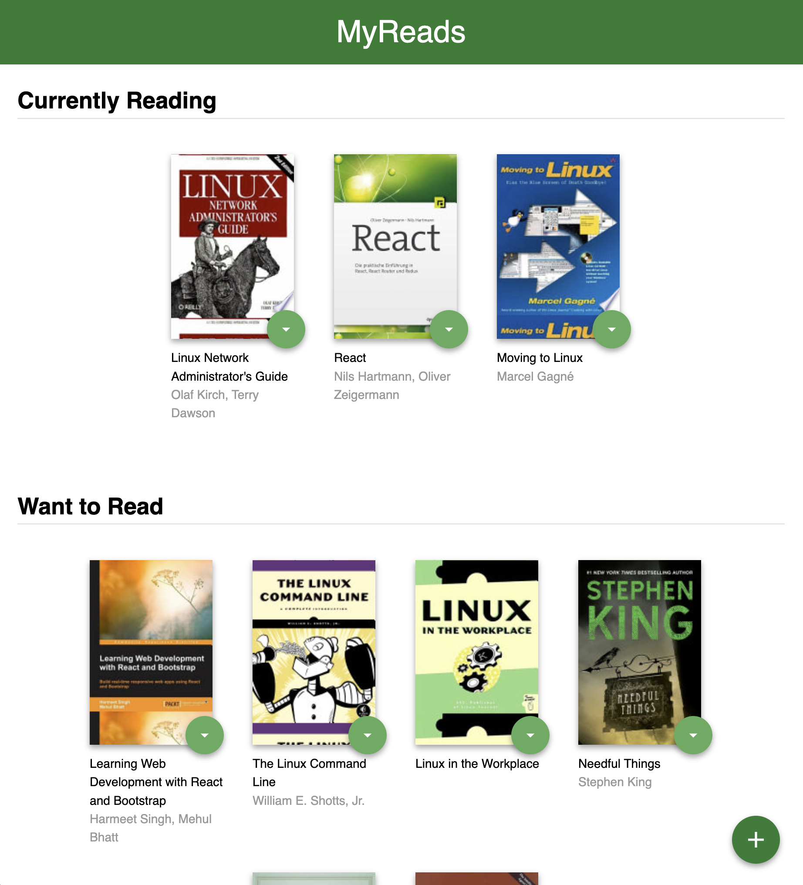
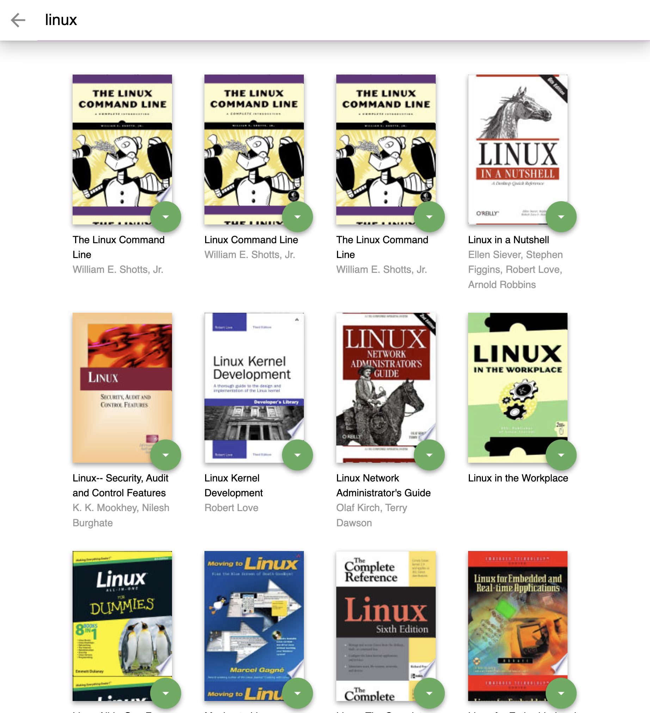

# MyReads Project

MyReads project is a bookshelf app created as part of the Udacity React Nanodegree Program. It allows users to select and categorize books into three shelves: Currently Reading, Want to Read, and Read. The application also provides a search functionality to find and add new books to the shelves.

### Prerequisites

Before you begin, ensure you have installed the latest version of [Node.js and npm](https://nodejs.org/en/download/).

### Installation

To install MyReads, follow these steps:

1. Clone the repository
2. Navigate to the repository directory and run:

```bash
npm install
npm start
```

### Screenshots

| Main Page | Search Page |
|:---------:|:-----------:|
|  |  |